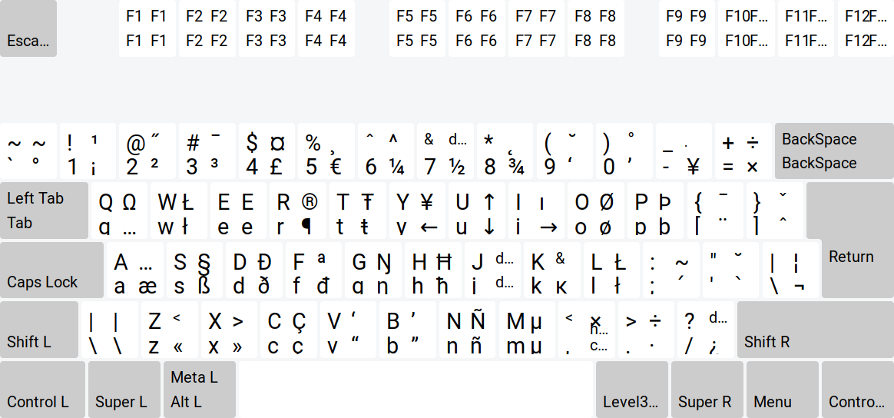

# English (US) + Catalan XKB distribution
Custom X KeyBoard layout for English (US) + Catalan, which gives easy access to:
 - `ccedilla` (ç) via <kbd>AltGr</kbd>+<kbd>c</kbd>.
 - `ntilde` (ñ) via <kbd>AltGr</kbd>+<kbd>n</kbd>.
 - Some other combinaitons, such as diacritical marks.

Of course, the <kbd>Shift</kbd> modifier will allow typing capital Ç and Ñ.

Bellow you can see the keyboard layout:



## Installation

Simple, you just run the script from the root of the source folder:
```bash
./INSTALL
```

Apparently, in Debian/Ubuntu systems, you also need to run the following after the installation:
```bash
sudo dpkg-reconfigure xkb-data
```
